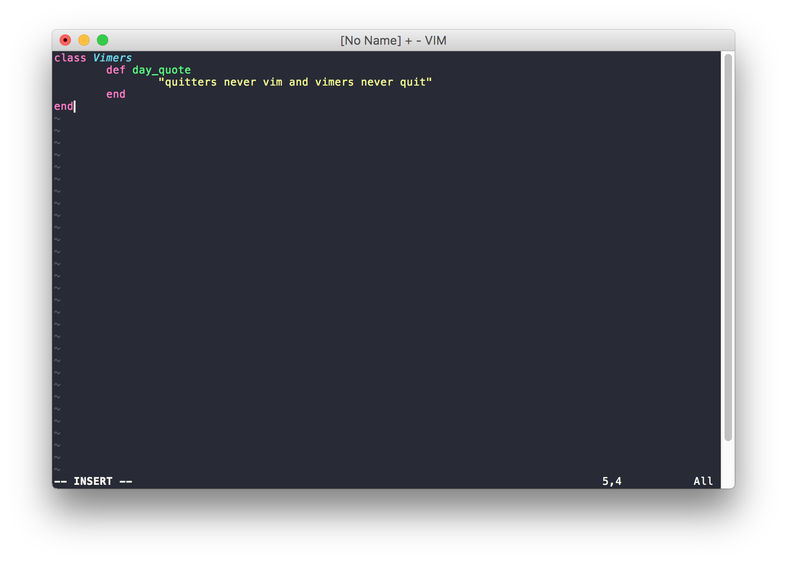

# Moment of silence
I dedicate this section for us just to take a moment of silence for the poor souls who consider vim as a bad 
version of Windows notepad.
Ok, now back to work ...
# theme
I'm currently using [dracula](https://draculatheme.com/vim/) theme for vim

# usage
clone this under ~/.vim directory
```
cd
cd .vim
git clone https://github.com/chaymaeBZ/dotfiles.git
```
# macVim support
if you're a macVim user and want to include that theme by default, please consider these extra steps :
  - create a .vimrc file under ~/ directory
  - load from an external source ( in this case my .vimrc file )

your ~/.vimrc content should be like this :
```
source ~/.vim/.dotfiles/.vimrc
```
